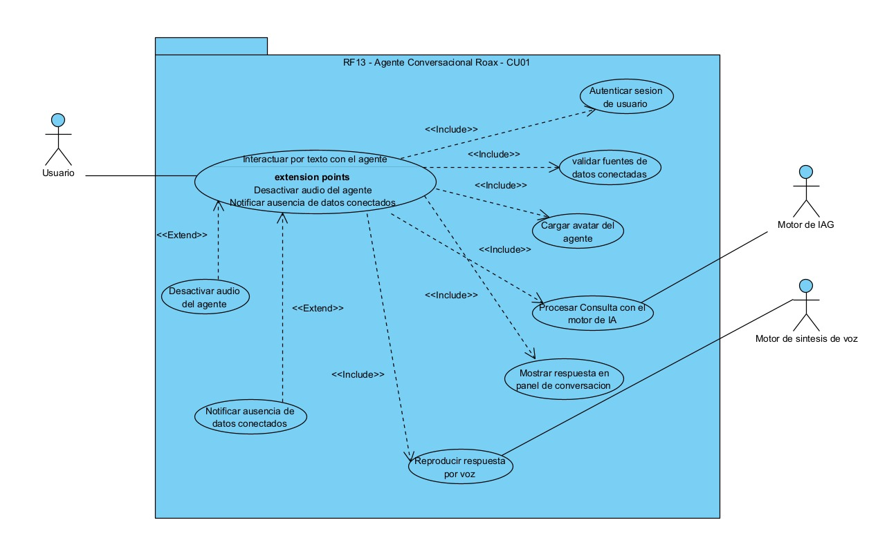
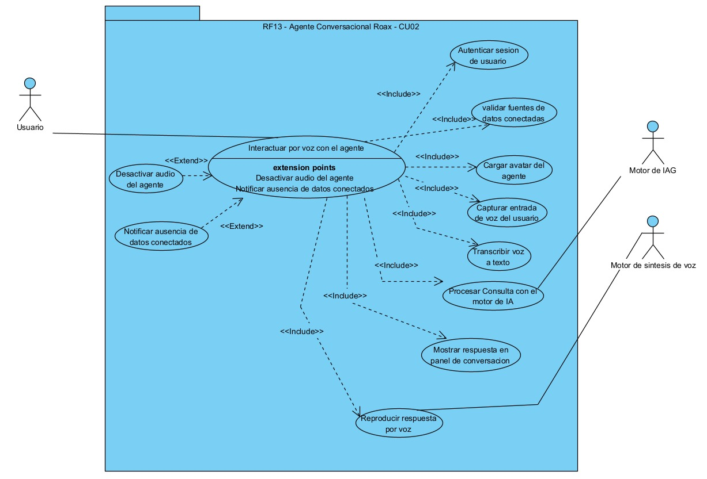
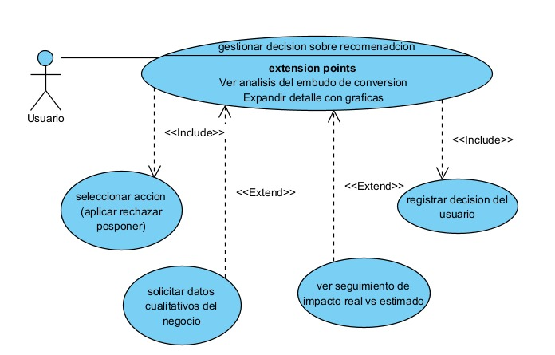
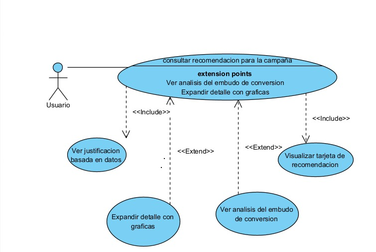
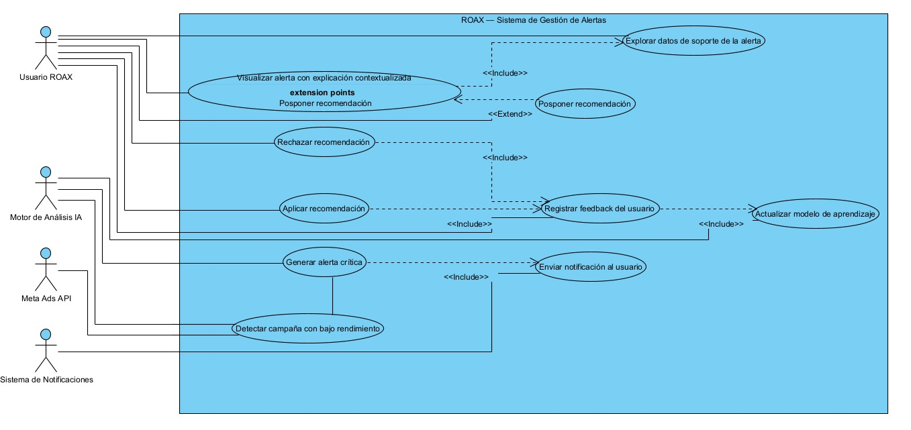
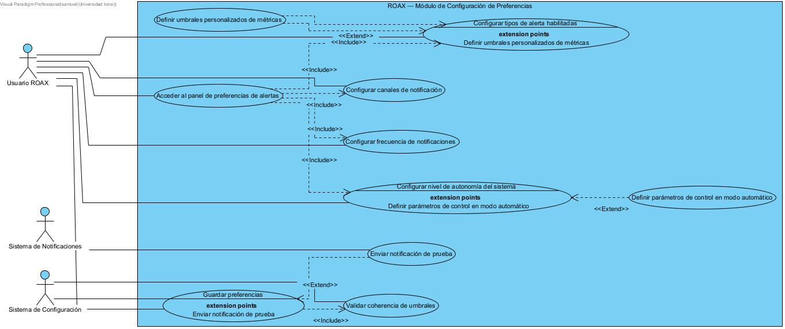

# DOCUMENTO DE ESPECIFICACIÓN DE REQUERIMIENTOS

## ROAX

---

**INTEGRANTES**

- Melisa Gomez Gomez
- Samuel Alejandro Estupiñan Gonzales
- Jorge Humberto Garcia Leon
- Juan Camilo Borrero Florez
- Juan Pablo Urbina Ladino
- Matius Montealegre Padilla

---

# Tabla de Contenido

1. Especificación de Requerimientos
   - 1.1 Descripción general
   - 1.2 Contexto del proyecto
   - 1.3 Requisitos
   - 1.4 Subespecificación por subsistemas
   - 1.5 Tabla de asignación a subsistemas
2. PESTLE
3. RF13: Agente Conversacional — Historias de usuario
4. RF14: Recomendaciones Inteligentes — Historias de usuario
5. RF15: Gestión de Alertas — Historias de usuario
6. RF16: Retroalimentación y Aprendizaje — Historias de usuario

---

# 1. Especificación de Requerimientos

## 1.1 Descripción General

El presente documento describe el análisis, diseño y propuesta de solución para el **Reto 4: Confianza Progresiva** del proyecto **ROAX by Dropi**, desarrollado en el marco de la asignatura de Ingeniería de Software.

El reto consiste en diseñar un sistema que permita a la plataforma ROAX pasar de mostrar datos a tomar decisiones concretas por el usuario, construyendo gradualmente la confianza necesaria para que este delegue acciones críticas de su negocio a la inteligencia artificial. Para ello se identificaron requerimientos funcionales y no funcionales, se propuso una arquitectura de solución y se desarrolló un prototipo visual del agente inteligente.

---

## 1.2 Contexto del Proyecto

**ROAX by Dropi** es una plataforma de inteligencia de negocio para e-commerce que integra datos de publicidad digital (Meta Ads, y próximamente TikTok) con datos reales de ventas y logística (Shopify, Tienda Nube, WooCommerce y Dropi), con el objetivo de calcular la rentabilidad real de un negocio digital.

La plataforma actualmente cuenta con más de 5.600 usuarios registrados y opera en dos modalidades: como módulo interno dentro de Dropi, y como plataforma externa independiente en app.roaxai.com, que es el foco del presente proyecto.

Hoy, ROAX funciona principalmente como una plataforma de reportería: conecta fuentes de datos, calcula métricas clave como ROAS, CPA, CTR, CPC y CPM, y genera alertas sobre el rendimiento de las campañas. Sin embargo, el modelo actual presenta una limitación estructural: muestra información pero no ayuda a tomar decisiones. El usuario debe interpretar solo qué significan los números y qué hacer con ellos, lo cual genera una alta fricción en la adopción del producto.

Con el avance de la inteligencia artificial, las plataformas de data enfrentan el reto de evolucionar: pasar de responder "¿qué está pasando?" a responder "¿qué debo hacer para mejorar mi negocio?". En este contexto, ROAX plantea su **Refactor 2026**, un proceso de rediseño profundo orientado a convertir la IA en el motor central de decisiones de la plataforma.

Dentro de este refactor se definen cuatro retos técnicos. El presente proyecto aborda el **Reto 4: Confianza Progresiva**, cuyo foco es diseñar el mecanismo mediante el cual un sistema de recomendaciones basado en IA logra que el usuario confíe en él, actúe sobre sus sugerencias, y permita que el sistema aprenda y mejore con el tiempo.

Este reto cobra especial relevancia dado el contexto del usuario de ROAX: un emprendedor o marca que invierte en promedio entre 1.500 y 2.000 dólares mensuales en publicidad digital, que opera en múltiples plataformas simultáneamente, y que ya ha desarrollado una desconfianza hacia las recomendaciones automáticas de Meta, debido a que estas priorizan el gasto publicitario por encima de la rentabilidad real del negocio.

---

## 1.3 Requisitos

### Requerimientos Funcionales

| **RF** | **Descripción** |
| --- | --- |
| **RF13** | El sistema debe permitir la comunicación con el usuario mediante un agente conversacional visual en tiempo real |
| **RF14** | El sistema debe generar y presentar recomendaciones inteligentes sobre campañas publicitarias basadas en análisis de datos y comportamiento histórico |
| **RF15** | El sistema debe gestionar alertas priorizadas sobre indicadores críticos del negocio evitando la saturación de información al usuario |
| **RF16** | El sistema debe gestionar la retroalimentación del usuario y ajustar progresivamente sus recomendaciones para construir confianza progresiva |

### Requerimientos No Funcionales

| **RNF** | **Descripción** |
| --- | --- |
| **RNF1** | **Disponibilidad:** el sistema debe estar disponible 24/7 para monitoreo continuo de campañas |
| **RNF2** | **Procesamiento en tiempo real:** el sistema debe procesar y analizar datos con mínima latencia |
| **RNF3** | **Interfaz de usuario:** el sistema debe ofrecer una interfaz intuitiva, clara y orientada a la toma de decisiones |
| **RNF4** | **Portabilidad:** el sistema debe ser accesible desde múltiples dispositivos incluyendo móviles |
| **RNF5** | **Interacción por voz:** el sistema debe permitir interacción mediante audio procesando comandos en tiempo real |
| **RNF6** | **Transparencia IA:** el sistema debe hacer visible cuando una recomendación es generada por inteligencia artificial |
| **RNF7** | **Escalabilidad:** el sistema debe gestionar el consumo de recursos según el plan de suscripción del usuario |

---

## 1.4 Subespecificación por Subsistemas

### RF13 — Agente Conversacional Visual (ACV)

| **ID** | **Subrequerimiento** |
| --- | --- |
| **ACV R13.1** | El sistema debe mostrar el avatar visual del agente mediante una ventana fija en la interfaz principal de la plataforma |
| **ACV R13.2** | El sistema debe reproducir la voz del agente mediante síntesis de voz clonada de actriz al momento de emitir una recomendación o alerta |
| **ACV R13.3** | El sistema debe mostrar el texto de la respuesta en un panel de conversación junto al avatar para usuarios que prefieran leer |
| **ACV R13.4** | El sistema debe permitir al usuario enviar mensajes al agente mediante un campo de texto o por entrada de voz |
| **ACV R13.5** | El sistema debe responder al usuario en lenguaje natural evitando tecnicismos innecesarios mediante el procesamiento del LLM |
| **ACV R13.6** | El sistema debe permitir al usuario activar o desactivar la voz del agente mediante un botón de configuración en la interfaz |

---

### RF14 — Recomendaciones Inteligentes (REC)

| **ID** | **Subrequerimiento** |
| --- | --- |
| **REC R14.1** | El sistema debe identificar automáticamente campañas con bajo rendimiento mediante el análisis de métricas como ROAS, CPA, CTR y comportamiento histórico |
| **REC R14.2** | El sistema debe presentar cada recomendación en una tarjeta de acción que incluya la acción sugerida, la explicación basada en datos y la estimación de impacto esperado |
| **REC R14.3** | El sistema debe permitir al usuario interactuar con cada recomendación mediante tres opciones: Aplicar, Rechazar o Posponer, mostradas como botones diferenciados en la interfaz |
| **REC R14.4** | El sistema debe permitir al usuario expandir cada recomendación para acceder a una vista detallada con gráficas de evolución temporal y análisis del embudo de conversión |
| **REC R14.5** | El sistema debe solicitar y almacenar información cualitativa del negocio (inventario disponible, costos fijos, perfil del cliente) mediante un formulario de onboarding para mejorar la precisión de las recomendaciones |
| **REC R14.6** | El sistema debe mostrar, posterior a la aplicación de una recomendación, un seguimiento del impacto real versus el impacto estimado en formato antes/después con métricas en valores monetarios y porcentajes |

---

### RF15 — Gestión de Alertas (ALR)

| **ID** | **Subrequerimiento** |
| --- | --- |
| **ALR R15.1** | El sistema debe enviar notificaciones inmediatas al usuario cuando detecte una campaña en situación crítica, priorizando aquellas con mayor impacto económico potencial |
| **ALR R15.2** | El sistema debe agrupar y priorizar las alertas según su impacto potencial mediante un sistema de pesos por indicador, mostrando un máximo de alertas críticas por sesión |
| **ALR R15.3** | El sistema debe analizar indicadores en conjunto (CTR + CPA + CBR) en lugar de dispararlos individualmente, para evitar la saturación de alertas al usuario |
| **ALR R15.4** | El sistema debe permitir al usuario configurar sus preferencias de notificación incluyendo canales (in-app, correo, WhatsApp, push móvil), horarios de envío y nivel de criticidad mínimo |

---

### RF16 — Retroalimentación y Aprendizaje (RFA)

| **ID** | **Subrequerimiento** |
| --- | --- |
| **RFA R16.1** | El sistema debe presentar al usuario un mecanismo de retroalimentación explícita que le permita calificar la utilidad de cada recomendación (útil, incorrecta, irrelevante) con comentario opcional |
| **RFA R16.2** | El sistema debe registrar retroalimentación implícita derivada del comportamiento del usuario: frecuencia de aceptación, tiempo antes de actuar, recomendaciones ignoradas y acciones revertidas |
| **RFA R16.3** | El sistema debe continuar generando recomendaciones aunque el usuario las rechace de forma repetida, ajustando el tipo y enfoque de las sugerencias según el patrón detectado |
| **RFA R16.4** | El sistema debe permitir al usuario configurar niveles de automatización desde recomendaciones manuales hasta ejecución automática de acciones según su preferencia y nivel de confianza acumulada |
| **RFA R16.5** | El sistema debe mostrar al usuario un indicador de nivel de confianza acumulada con el agente de IA, reflejando el historial de recomendaciones aceptadas y sus resultados medibles |

---

## 1.5 Tabla de Asignación a Subsistemas

| **Requerimiento** | **RF13 - ACV** | **RF14 - REC** | **RF15 - ALR** | **RF16 - RFA** |
| --- | :---: | :---: | :---: | :---: |
| Agente conversacional visual | X | | | |
| Síntesis de voz clonada | X | | | |
| Identificación de campañas | | X | | |
| Tarjetas de recomendación | | X | | |
| Opciones aplicar/rechazar/posponer | | X | | |
| Datos cualitativos del negocio | | X | | |
| Alertas priorizadas | | | X | |
| Sistema de pesos de indicadores | | | X | |
| Configuración de notificaciones | | | X | |
| Retroalimentación explícita | | | | X |
| Aprendizaje por comportamiento | | | | X |
| Niveles de automatización | | | | X |
| Indicador de confianza acumulada | | | | X |

---

# 2. PESTLE

> El análisis PESTLE se aplica a los requerimientos funcionales que toman decisiones sobre personas, usan datos sensibles o pueden generar impacto negativo. Para cada dimensión se identifica el hallazgo verificado, su impacto real y el requerimiento derivado.

---

## PESTLE — RF13: Agente Conversacional Visual

| Dimensión | Hallazgo | Impacto | Requerimiento derivado |
|-----------|----------|---------|----------------------|
| **P — Político** | Colombia tiene en trámite el Proyecto de Ley 043 de 2025 de Inteligencia Artificial, radicado ante el Congreso por MinCiencias y MinTIC, que clasifica los sistemas de IA por nivel de riesgo. Los agentes conversacionales que toman decisiones comerciales podrían clasificarse como riesgo limitado o alto según este marco. | Si el proyecto es aprobado, los agentes de IA conversacionales deberán cumplir con requisitos de trazabilidad, transparencia y gobernanza. | El sistema debe documentar y hacer trazable toda acción sugerida o ejecutada por el agente de IA. |
| **E — Económico** | La síntesis de voz clonada y el procesamiento LLM en tiempo real implican costos por token y por llamada a APIs externas. Con más de 5.600 usuarios activos, el costo por interacción puede escalar rápidamente.| Sin control de consumo, el servicio puede volverse inviable a escala. | El sistema debe gestionar el consumo por niveles de suscripción e implementar caché de respuestas frecuentes para reducir costos. |
| **S — Social** | Usuarios con discapacidad auditiva pueden verse excluidos de la interacción verbal.| Un agente que solo funciona por voz excluye a usuarios con discapacidad auditiva o en entornos ruidosos. | El sistema debe mostrar siempre el texto de las respuestas de forma simultánea a la voz. |
| **T — Tecnológico** | La síntesis de voz en tiempo real con más de 5.600 usuarios puede desbordarse bajo alta concurrencia.| Si el motor de voz se satura, el agente pierde respuesta en tiempo real destruyendo la experiencia del usuario. | El sistema debe degradar al modo texto cuando el procesamiento de voz supere la capacidad disponible. |
| **L — Legal** | El agente accede a datos financieros del negocio. En Colombia aplica la Ley 1581 de Habeas Data. Dado que Dropi opera en Europa con más de 180.000 usuarios, el EU AI Act (vigente desde agosto 2024, plenamente aplicable desde agosto 2026) exige que los usuarios sean informados de que interactúan con una máquina. | No identificar el agente como IA ante usuarios europeos viola el EU AI Act, con multas de hasta 35 millones de euros. | El sistema debe identificar al agente como IA al inicio de cada sesión y cifrar las conversaciones almacenadas. |
| **E — Ético** |  la voz clonada puede ofrecerse como una opción elegible por el usuario junto a otras alternativas como voz sintética estándar o solo texto. | Si el usuario no sabe que interactúa con una IA, la confianza puede erosionarse cuando lo descubra. | El sistema debe ofrecer la voz clonada como una opción entre varias e identificar siempre al agente como IA independientemente de la modalidad elegida. |

---

## PESTLE — RF14: Recomendaciones Inteligentes

| Dimensión | Hallazgo | Impacto | Requerimiento derivado |
|-----------|----------|---------|----------------------|
| **P — Político** | Meta Ads ya está implementando en 2025-2026 restricciones en el acceso a datos para categorías sensibles (salud, finanzas, política).| El sistema puede perder datos clave para generar recomendaciones en categorías restringidas. | El sistema debe adaptarse cuando una fuente de datos esté parcialmente restringida sin interrumpir el servicio. |
| **E — Económico** | Un usuario promedio invierte entre 1.500 y 2.000 USD/mes en publicidad digital.| Una recomendación incorrecta puede generar pérdidas significativas y abandono de la plataforma. | El sistema debe mostrar el nivel de confianza de cada recomendación y advertir cuando los datos sean insuficientes. |
| **S — Social** |Entendimiento de las metricas dentro de ROAX | Si las recomendaciones usan jerga técnica el usuario no actúa sobre ellas. | El sistema debe presentar las recomendaciones en lenguaje no técnico. |
| **T — Tecnológico** | El cruce de datos entre Meta, Shopify y Dropi hoy es manual porque son bases de datos distintas | Datos inconsistentes pueden generar recomendaciones incorrectas y dañinas. | El sistema debe indicar la última sincronización de cada fuente y marcar recomendaciones de baja confianza si los datos están desactualizados. |
| **L — Legal** |  El EU AI Act exige transparencia sobre decisiones generadas por IA. | El sistema puede generar expectativas incorrectas si no aclara la naturaleza de sus sugerencias. | El sistema debe avisar que las recomendaciones son sugerencias automatizadas y que el usuario conserva la decisión final. |
| **E — Ético** |Usar datos agregados de todos los usuarios para mejorar recomendaciones individuales es válido y valioso. | El modelo puede volverse sesgado y perjudicial si no contrasta con parámetros objetivos de rentabilidad. | El sistema debe combinar el aprendizaje individual con benchmarks de industria y alertar cuando los patrones del usuario afecten negativamente su ROAS. |

---

## PESTLE — RF15: Gestión de Alertas

| Dimensión | Hallazgo | Impacto | Requerimiento derivado |
|-----------|----------|---------|----------------------|
| **P — Político** | Dado que Dropi opera en Europa, el envío de alertas con datos financieros a usuarios europeos está sujeto al GDPR y al EU AI Act. Las notificaciones automatizadas con datos personales deben cumplir requisitos de consentimiento. | Sin cumplimiento del GDPR, ROAX puede recibir sanciones regulatorias europeas. | El sistema debe diferenciar los perfiles de notificación según la región del usuario. |
| **E — Económico** | El envío masivo de alertas por correo o push implica costos por notificación que escalan con la base de usuarios. | Sin control, los costos de notificación pueden volverse inviables económicamente. | El sistema debe agrupar alertas para reducir el volumen de notificaciones sin perder cobertura crítica. |
| **S — Social** | Laura mencionó que el sistema anterior generaba hasta 250 alertas diarias causando fatiga total. Algunos canales menos invasivos como WhatsApp o correo electrónico. | La saturación de alertas lleva al usuario a desactivarlas todas, perdiendo el valor del monitoreo 24/7. | El sistema debe limitar las alertas críticas y ofrecer canales menos invasivos configurables por el usuario. |
| **T — Tecnológico** | El motor de alertas debe operar 24/7.  | Una falla nocturna puede generar pérdidas significativas y destruir la confianza en el sistema. | El sistema debe implementar redundancia en el motor de alertas y notificar al usuario ante cualquier interrupción. |
| **L — Legal** | Las alertas con métricas financieras enviadas por canales externos deben estar cifradas según la Ley 1581 y el GDPR. | El envío de datos financieros sin cifrado constituye una violación de datos personales. | El sistema debe cifrar el contenido de las notificaciones que incluyan métricas financieras del usuario. |
| **E — Ético** | El sistema prioriza alertas por impacto económico absoluto, lo que puede perjudicar a usuarios con menor volumen de inversión. | Un usuario pequeño puede perder el 100% de su presupuesto sin recibir alertas críticas. | El sistema debe calcular el impacto de las alertas de forma relativa al presupuesto de cada usuario. |

---

## PESTLE — RF16: Retroalimentación y Aprendizaje

| Dimensión | Hallazgo | Impacto | Requerimiento derivado |
|-----------|----------|---------|----------------------|
| **P — Político** | ROAX opera actualmente en Latinoamérica y Europa a través de Dropi, que tiene más de 180.000 usuarios en esa región. El EU AI Act ya está en vigor desde agosto 2024 con alcance extraterritorial y multas de hasta 35 millones de euros. | Si el motor de aprendizaje no es auditable, ROAX puede enfrentar sanciones europeas que afecten su operación en toda la región. | El sistema debe mantener logs auditables de cómo la retroalimentación del usuario modifica el modelo de recomendaciones. |
| **E — Económico** | El reentrenamiento del modelo con retroalimentación de más de 5.600 usuarios puede crecer en costos computacionales de forma no lineal. | Costos insostenibles pueden limitar la frecuencia de actualización reduciendo la personalización percibida. | El sistema debe actualizar el modelo por lotes con un ciclo máximo de 24 horas para optimizar costos. |
| **S — Social** | Usuarios con alta desconfianza inicial rechazan todas las recomendaciones sin probarlas.| Sin interacciones iniciales el sistema no puede personalizar, generando el ciclo de baja confianza.| El sistema debe ofrecer un modo de observación donde el usuario vea el impacto hipotético de recomendaciones sin necesidad de aplicarlas. |
| **T — Tecnológico** | La automatización completa requiere integración con la API de Meta, que ya ha cambiado políticas de forma abrupta y está restringiendo categorías en 2025-2026. | Si Meta revoca permisos sin aviso, la automatización falla en el momento más crítico. | El sistema debe verificar los permisos de escritura de Meta antes de cada acción automatizada. |
| **L — Legal** | El historial de comportamiento del usuario es un dato personal bajo la Ley 1581 y el GDPR, que incluye el derecho al olvido para usuarios europeos. | Almacenar datos de comportamiento sin mecanismo de eliminación viola ambas regulaciones. | El sistema debe permitir al usuario eliminar su historial de interacciones y reiniciar su modelo personalizado. |
| **E — Ético** |La IA debe usar datos de toda la base de usuarios para enriquecer recomendaciones, pero también debe proteger al usuario de reforzar sus propias malas prácticas. | El sistema puede volverse cómplice de pérdidas si refuerza decisiones que el usuario acepta pero que son objetivamente perjudiciales. | El sistema debe balancear el aprendizaje individual con parámetros objetivos de rentabilidad de la industria. |

---

# 3. RF13 — Agente Conversacional Visual (ACV)

## 3.1 Historias de Usuario

| **Campo** | **Descripción** |
| --- | --- |
| **Título** | Interacción con el agente de IA |
| **Yo, como** | usuario de ROAX (emprendedor o gestor de e-commerce) |
| **Quiero** | comunicarme con un agente de IA mediante voz o texto que me muestre su avatar en pantalla |
| **Para** | entender mis métricas y recomendaciones sin necesidad de interpretar dashboards complejos |

**Scenario 1**

| | |
| --- | --- |
| **Given** | el usuario accede a la plataforma |
| **When** | el agente se carga |
| **Then** | el sistema muestra el avatar, reproduce un saludo e informa que el agente es IA |

**Scenario 2**

| | |
| --- | --- |
| **Given** | el usuario envía un mensaje |
| **When** | el agente procesa la consulta |
| **Then** | responde en lenguaje natural mostrando texto de forma simultánea independientemente del canal de voz |

**Scenario 3**

| | |
| --- | --- |
| **Given** | el usuario desactiva el audio |
| **When** | hace clic en el botón de configuración |
| **Then** | el agente continúa respondiendo solo con texto sin perder funcionalidad |

## 3.2 Caso de uso 

## Caso de uso 01-RF13

## Caso de uso 2 -RF13

## 3.3 Formatos Bicolumnares 

## Formato Bicolumnar-01-RF13

[Formato Bicolumnar-01-RF13](https://docs.google.com/document/d/1TDo1TTdEj_wKEtHp9ctVsHX_yG9c6Bq6nMTPyKIl7fE/edit?usp=sharing)

## Formato Bicolumnar-02-RF13

[Formato Bicolumnar-02-RF13](https://docs.google.com/document/d/1W9J1i2ecVRGP5G9hOKJs7YT8tL1P38t-gC1fvb_BG3k/edit?usp=sharing)

---

# 4. RF14 — Recomendaciones Inteligentes (REC)

## 4.1 Historias de Usuario

| **Campo** | **Descripción** |
| --- | --- |
| **Título** | Recibir y actuar sobre recomendaciones de campañas |
| **Yo, como** | usuario de ROAX con campañas activas en Meta Ads |
| **Quiero** | recibir recomendaciones claras sobre qué hacer con mis campañas, con su justificación y estimación de impacto |
| **Para** | tomar decisiones informadas sin necesidad de ser experto en métricas publicitarias |

**Scenario 1**

| | |
| --- | --- |
| **Given** | el sistema detecta una campaña con rendimiento por debajo del umbral de la industria |
| **When** | genera la recomendación |
| **Then** | muestra una tarjeta con la acción sugerida en lenguaje simple, la justificación y el impacto estimado |

**Scenario 2**

| | |
| --- | --- |
| **Given** | el usuario revisa una recomendación |
| **When** | hace clic en Aplicar |
| **Then** | el sistema ejecuta la acción y comienza el seguimiento del impacto real versus el estimado |

**Scenario 3**

| | |
| --- | --- |
| **Given** | el usuario rechaza una recomendación |
| **When** | selecciona un motivo |
| **Then** | el sistema registra el rechazo, ajusta el enfoque y continúa generando recomendaciones |

## 4.2 Caso de uso 

## Caso de uso 01-RF14:

## Caso de uso 02-RF14:

## 4.3 Formatos Bicolumnares 

## Formato Bicolumnar-01-RF14:

[Formato Bicolumnar-01-RF14](https://docs.google.com/document/d/1XEnIszNS_L7ecwf0LtUeyBp6_ZerAuZBfnwhDKyjlcs/edit?usp=sharing)

## Formato Bicolumnar-02-RF14:

[Formato Bicolumnar-02-RF14](https://docs.google.com/document/d/1-K1FWEDIBLcpTYH0QG6UmPqgaPHUBNcKKdLmWMUeu2A/edit?usp=sharing)

---

# 5. RF15 — Gestión de Alertas (ALR)

## 5.1 Historias de Usuario

| **Campo** | **Descripción** |
| --- | --- |
| **Título** | Recibir alertas críticas sin saturación |
| **Yo, como** | usuario de ROAX con campañas activas fuera del horario laboral |
| **Quiero** | recibir alertas priorizadas sobre situaciones críticas en tiempo real |
| **Para** | actuar rápido sin ahogarme en notificaciones irrelevantes |

**Scenario 1**

| | |
| --- | --- |
| **Given** | el sistema detecta una campaña con gasto elevado sin conversiones |
| **When** | evalúa el impacto relativo al presupuesto del usuario |
| **Then** | envía una alerta crítica por el canal configurado con la situación y las opciones de acción |

**Scenario 2**

| | |
| --- | --- |
| **Given** | el usuario tiene múltiples campañas con indicadores fuera de rango |
| **When** | el sistema evalúa los indicadores en conjunto |
| **Then** | agrupa las alertas por criticidad y presenta un máximo configurable sin saturar al usuario |

**Scenario 3**

| | |
| --- | --- |
| **Given** | el usuario quiere configurar sus notificaciones |
| **When** | accede a la sección de alertas |
| **Then** | puede definir canales (in-app, correo, WhatsApp, push), horarios y nivel mínimo de criticidad |

## 5.2 Caso de uso 

## Caso de uso 01-RF15:

## Caso de uso 02-RF15_

## 5.3 Formatos Bicolumnares 

## Formato Bicolumnar-01-RF15

[Formato Bicolumnar-01-RF15](https://docs.google.com/document/d/1tnP73K3gOLi3lbml82Woqx60uFBn9MJfaYvp_luhMEg/edit?usp=sharing)

## Formato Bicolumnar-02-RF15

[Formato Bicolumnar-02-RF15](https://docs.google.com/document/d/1JD7duImYBW1lOvTrh6khlGdWskXr-8m9sPR6lQ6Sl3E/edit?usp=sharing)

---

# 6. RF16 — Retroalimentación y Aprendizaje (RFA)

## 6.1 Historias de Usuario

| **Campo** | **Descripción** |
| --- | --- |
| **Título** | Construir confianza progresiva con el agente |
| **Yo, como** | usuario de ROAX que usa las recomendaciones del sistema |
| **Quiero** | ver cómo el sistema aprende de mis decisiones y poder delegar autonomía gradualmente |
| **Para** | confiar en el sistema y permitirle actuar en mi nombre cuando esté fuera |

**Scenario 1**

| | |
| --- | --- |
| **Given** | el usuario ha aplicado varias recomendaciones con resultados positivos |
| **When** | el sistema calcula el nivel de confianza acumulada |
| **Then** | muestra el indicador actualizado y sugiere activar un nivel mayor de automatización |

**Scenario 2**

| | |
| --- | --- |
| **Given** | el usuario rechaza repetidamente un tipo de recomendación |
| **When** | el modelo procesa el patrón |
| **Then** | ajusta el enfoque de futuras recomendaciones sin dejar de recomendar |

**Scenario 3**

| | |
| --- | --- |
| **Given** | el usuario tiene activado el modo de automatización |
| **When** | el sistema va a ejecutar una acción automática |
| **Then** | verifica permisos, ejecuta la acción, notifica al usuario y le ofrece revertirla dentro de 24 horas |

## 6.2 Caso de uso 

## 6.3 Formatos Bicolumnares 

## Formato Bicolumnar-01-RF16

[Formato Bicolumnar-01-RF16](https://docs.google.com/document/d/1iAuLzWd_MS7xk6nPBQ9Vc4ATOAfWvXaoF6ExM6D663c/edit?usp=sharing)

## Formato Bicolumnar-02-RF16

[Formato Bicolumnar-02-RF16](https://docs.google.com/document/d/1XDNQ0x9D_c9VJY83ohNyv0WCq8bmWZJhL6SQxBMDttM/edit?usp=sharing)
